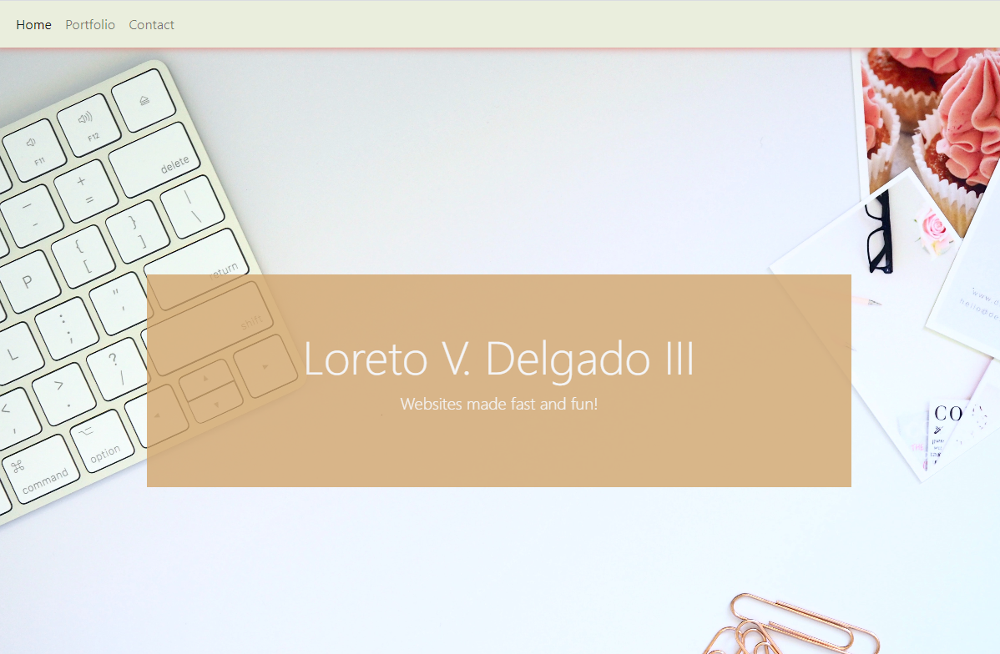
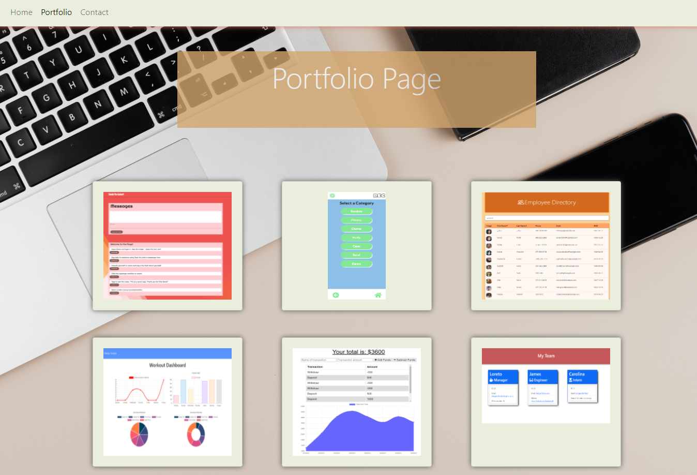
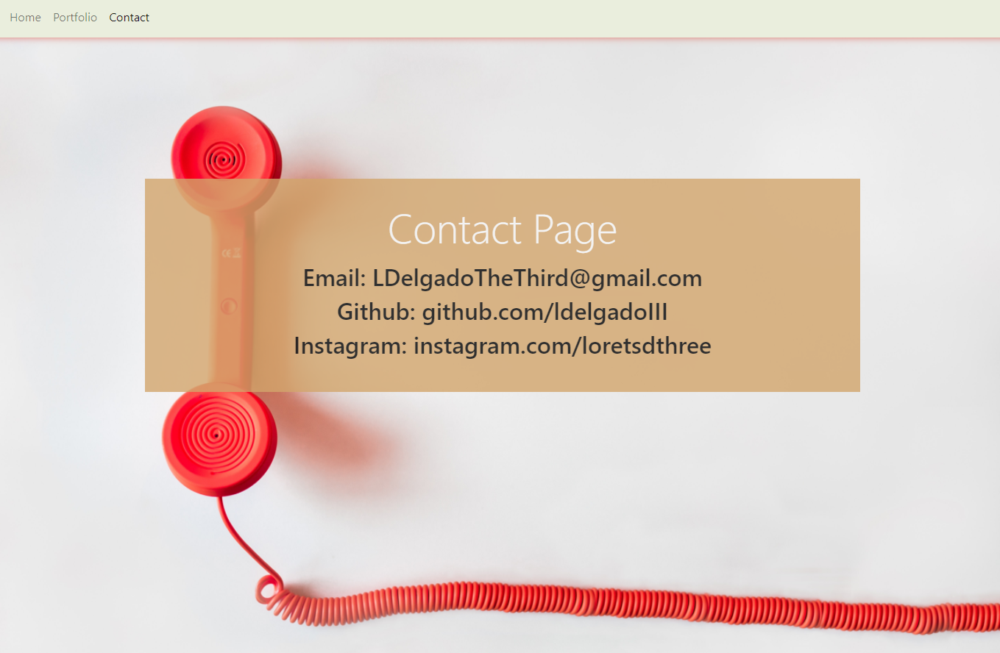

# React Portflio
  
  
  ## Descriptions

  This website uses react to build a complete website portfolio. Using react router users are able to navigate between the applications pages by clicking through the navbar. The portfolio item cards are also generated by reusing components as opposed to hard-coding each individual card.

  ## Table of Contents

  * [Installation](#installation)
  * [Usage](#usage)
  * [License](#license)
  * [Credits](#contributing)
  * [Tests](#tests)
  * [Questions](#questions)
    
  ## Installation
  
  Users should install bootstrap, react, react-dom, react-router-dom, and react-scripts
  
  ## Usage

  
  
  

  ## License

  This application is covered by the Creative Commons license.

  ## Contributing

  There were no collaborators for this project

  ## Tests

  There are no tests for this project.

  ## Questions

  If you have any questions please send an email to: ldelgadothethird@gmail.com or go to github at: https://github.com/ldelgadoIII

